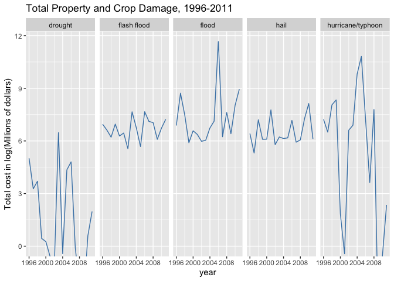

## Synopsis

It is perhaps not surprising that the economic cost of Hurricane Katrina (2005) is an order of magnitude above all other weather events in the Storm data set.  (add more detail here)  What is perhaps unexpected is that excessive heat leads to the most deaths. As my daughter pointed out, if the news outlets warn of a major impending storm, most reasonable people make plans to move out of harms way.  This is less likely to be true when there is a forecast of higher than normal temperatures; hence the greater death rate.  Other the other hand, tornados lead to a greater number of injuries, perhaps due to air-born debrie.   

Does the document have a synopsis that describes and summarizes the data analysis in less than 10 sentences?


##  Data Processing

Thanks to Mentor Usama Khalil's useful post on cleaning the storm data. [https://www.coursera.org/learn/reproducible-research/discussions/all/threads/38y35MMiEeiERhLphT2-QA]  and this guide to handling the coding of CROPDMGEXP and PROPDMGEXP [https://rstudio-pubs-static.s3.amazonaws.com/58957_37b6723ee52b455990e149edde45e5b6.html]


```r
library(downloader)
fileUrl <- "https://d396qusza40orc.cloudfront.net/repdata%2Fdata%2FStormData.csv.bz2"
download.file(fileUrl, destfile = "noaa.csv.bz2", method="curl")
data <- read.csv("noaa.csv.bz2")
```

### Data Transformation

#### Check out data and delete unnecessary columns


```r
library(dplyr)
```

```
## 
## Attaching package: 'dplyr'
```

```
## The following objects are masked from 'package:stats':
## 
##     filter, lag
```

```
## The following objects are masked from 'package:base':
## 
##     intersect, setdiff, setequal, union
```

```r
str(data)
```

```
## 'data.frame':	902297 obs. of  37 variables:
##  $ STATE__   : num  1 1 1 1 1 1 1 1 1 1 ...
##  $ BGN_DATE  : chr  "4/18/1950 0:00:00" "4/18/1950 0:00:00" "2/20/1951 0:00:00" "6/8/1951 0:00:00" ...
##  $ BGN_TIME  : chr  "0130" "0145" "1600" "0900" ...
##  $ TIME_ZONE : chr  "CST" "CST" "CST" "CST" ...
##  $ COUNTY    : num  97 3 57 89 43 77 9 123 125 57 ...
##  $ COUNTYNAME: chr  "MOBILE" "BALDWIN" "FAYETTE" "MADISON" ...
##  $ STATE     : chr  "AL" "AL" "AL" "AL" ...
##  $ EVTYPE    : chr  "TORNADO" "TORNADO" "TORNADO" "TORNADO" ...
##  $ BGN_RANGE : num  0 0 0 0 0 0 0 0 0 0 ...
##  $ BGN_AZI   : chr  "" "" "" "" ...
##  $ BGN_LOCATI: chr  "" "" "" "" ...
##  $ END_DATE  : chr  "" "" "" "" ...
##  $ END_TIME  : chr  "" "" "" "" ...
##  $ COUNTY_END: num  0 0 0 0 0 0 0 0 0 0 ...
##  $ COUNTYENDN: logi  NA NA NA NA NA NA ...
##  $ END_RANGE : num  0 0 0 0 0 0 0 0 0 0 ...
##  $ END_AZI   : chr  "" "" "" "" ...
##  $ END_LOCATI: chr  "" "" "" "" ...
##  $ LENGTH    : num  14 2 0.1 0 0 1.5 1.5 0 3.3 2.3 ...
##  $ WIDTH     : num  100 150 123 100 150 177 33 33 100 100 ...
##  $ F         : int  3 2 2 2 2 2 2 1 3 3 ...
##  $ MAG       : num  0 0 0 0 0 0 0 0 0 0 ...
##  $ FATALITIES: num  0 0 0 0 0 0 0 0 1 0 ...
##  $ INJURIES  : num  15 0 2 2 2 6 1 0 14 0 ...
##  $ PROPDMG   : num  25 2.5 25 2.5 2.5 2.5 2.5 2.5 25 25 ...
##  $ PROPDMGEXP: chr  "K" "K" "K" "K" ...
##  $ CROPDMG   : num  0 0 0 0 0 0 0 0 0 0 ...
##  $ CROPDMGEXP: chr  "" "" "" "" ...
##  $ WFO       : chr  "" "" "" "" ...
##  $ STATEOFFIC: chr  "" "" "" "" ...
##  $ ZONENAMES : chr  "" "" "" "" ...
##  $ LATITUDE  : num  3040 3042 3340 3458 3412 ...
##  $ LONGITUDE : num  8812 8755 8742 8626 8642 ...
##  $ LATITUDE_E: num  3051 0 0 0 0 ...
##  $ LONGITUDE_: num  8806 0 0 0 0 ...
##  $ REMARKS   : chr  "" "" "" "" ...
##  $ REFNUM    : num  1 2 3 4 5 6 7 8 9 10 ...
```

```r
data <- select(data, c(STATE, BGN_DATE, EVTYPE, FATALITIES, INJURIES, PROPDMG, PROPDMGEXP, CROPDMG, CROPDMGEXP))
```

#### Filter data based on number of weather events in data set

From the NOAA website, I learned that starting in 1996, 48 event types are recorded in the Storm Events Database.  Before 1996, only tornado (1950-present), thunderstorm, wind and hail (1955-present) were recorded. [https://www.ncdc.noaa.gov/stormevents/details.jsp]  Because this assignment asks us to determine which events have the biggest effect on human health or largest economic impact, I have filtered for data set to only include records with the complete set of event data from 1996.


```r
library(lubridate)
data$year <- year(mdy_hms(data$BGN_DATE)) 
data<- data[data$year > 1995,]
```

#### Cleaning the event type names

The event names are not all coded in the same way, so I created a new variable, event, that has all lower case letters and standardized event names by making the following transformations: 

* tolower was used to change the event names to lower case
* grepl was used to find the index of for all variations of a specific event type 
* the index was used to replace all variations with the official name, as stated in the documentation.[https://d396qusza40orc.cloudfront.net/repdata%2Fpeer2_doc%2Fpd01016005curr.pdf]


```r
data$event <- tolower(data$EVTYPE)

official_event_names <- tolower(c("Astronomical Low Tide", "Avalanche,     Blizzard", "Coastal Flood","Cold/Wind Chill", "Debris Flow", "Dense Fog", "Dense Smoke", "Drought", "Dust Devil", "Dust Storm", "Excessive Heat", "Extreme Cold/Wind Chill", "Flash Flood", "Flood", "Frost/Freeze", "Funnel Cloud",  "Freezing Fog", "Hail", "Heat", "Heavy Rain", "Heavy Snow",  "High Surf", "High Wind", "Hurricane/Typhoon", "Ice Storm", "Lake-Effect-Snow", "Lakeshore Flood", "Lightning",  "Marine Hail", "Marine High Wind", "Marine Strong Wind", "Marine Thunderstorm Wind", "Rip Current", "Seiche", "Sleet",
 "Storm Surge/Tide", "Strong Wind", "Thunderstorm Wind", "Tornado", "Tropical Depression", "Tropical Storm",  "Tsunami", "Volcanic Ash", "Waterspout", "Wildfire",  "Winter Storm", "Winter Weather"))
```


```r
a <- grepl("ashfall", data$event)
c <- grepl("coastal flood", data$event)
cf <- grepl("cstl flood", data$event)
cd <- grepl("[Dd]ry", data$event)
d <- grepl("[Cc]old", data$event)
f <- grepl("flash", data$event)
fz <- grepl("freeze", data$event)
fr <- grepl("freezing rain", data$event)
h <- grepl("hail", data$event)
hr <- grepl("hurricane", data$event)
l <- grepl("lake effect", data$event)
rp <- grepl("record precipitation", data$event)
rf <- grepl("rainfall", data$event)
r <- grepl("rain", data$event)
s <- grepl("snow", data$event)
sg <- grepl("surge", data$event)
sf <- grepl("surf", data$event)
t <- grepl("typhoon", data$event)
ts <- grepl("tstm", data$event)
wc <- grepl("windchill", data$event)
```


```r
library(stringr)
data$event[a == TRUE] <- "volcanic ash"
data$event[c == TRUE | cf == TRUE] <- "coastal flood"
data$event[c == TRUE | wc == TRUE] <- "extreme cold/wind chill"
data$event[d== TRUE] <- "drought"
data$event[f == TRUE] <- "flash flood"
data$event[rf==TRUE | rp==TRUE | r==TRUE ] <- "heavy rain"
data$event[fr == TRUE] <- "sleet"
data$event[fz == TRUE] <- "frost/freeze"
data$event[h == TRUE] <- "hail"
data$event[l == TRUE] <- "lake-effect"
data$event[sf == TRUE] <- "high surf"
data$event[s == TRUE] <- "heavy snow"
data$event[sg == TRUE] <- "storm surge/tide"
data$event[t == TRUE | hr == TRUE] <- "hurricane/typhoon"
data$event[ts == TRUE] <- "tsunami"
data$event <- str_replace(data$event, "strong winds", "strong wind")
data$event <- str_replace(data$event, "rip currents", "rip current")
data$event <- str_replace_all(data$event, "high wind (g40)", "high wind")
data$event <- str_replace_all(data$event, "dust devel", "dust devil")
data$event <- str_replace_all(data$event, "ice fog", "freezing fog")
```

There are some event names that are are not clearly in one of the standarized event types.  I decided to delete these instances from the data base. I checked to see which events did not match the official list after the above standardization.  


```r
library(dplyr)
bad_names <- setdiff(data$event, official_event_names)
data <- filter(data, event %in% official_event_names)
```

#### Filter data set to exclude rows w/ either missing data for PROPDMGEXP or 
CROPDMGEXP


```r
econ_df <- data[data$CROPDMGEXP != "" | 
                        data$PROPDMGEXP != "", ]
```

* Function to adjust for different units in CROPDMGEXP and PROPDMGEXP


```r
transform <- function (x, y) {

        if (x == "H" | x == "h")
                {y <- y * 10
        } else if (x == "K" | x == "k") 
                {y <- y * 10^3
        } else if (x == "M" | x == "m") 
                {y <- y * 10^6
        } else if (x == "B" | x == "b") 
                {y <- y * 10^9
        } else if (x == "-" | x == "?")
                 {y <- 0
        }
        y
}
```

* Use transform to adjust CROPDMGEXP and PROPDMGEXP


```r
econ_df$units_adj_cropdmg <- mapply(transform, 
                econ_df$CROPDMGEXP, econ_df$CROPDMG)
econ_df$units_adj_propdmg <- mapply(transform, 
                econ_df$PROPDMGEXP, econ_df$PROPDMG)
```

### Data Analysis

#### We were asked to explore which weather event type causes the most economic damage? To answer this question, I first found the total property and crop damage for each event type.  I then found the top ten most destructive weather types.   

* Find summary statistics by year for each event type.


```r
econ_damage <- econ_df %>% group_by(event) %>% 
                  summarize(total_property_damage = sum(units_adj_propdmg),
                  total_crop_damage = sum(units_adj_cropdmg) )
table <- econ_damage %>% arrange(desc(total_property_damage, total_crop_damage)) %>% top_n(10)
```

```
## Selecting by total_crop_damage
```


```r
library(knitr)
knit_table <- kable(table, caption="Top Ten Most Costly Weather types, by Property and Crop Damage")
print(knit_table)
```

```
## 
## 
## Table: Top Ten Most Costly Weather types, by Property and Crop Damage
## 
## |event             | total_property_damage| total_crop_damage|
## |:-----------------|---------------------:|-----------------:|
## |flood             |          143944833550|        4974778400|
## |hurricane/typhoon |           81718889010|        5350107800|
## |flash flood       |           15222268910|        1334901700|
## |hail              |           14595237420|        2496822450|
## |tropical storm    |            7642475550|         677711000|
## |high wind         |            5247860360|         633561300|
## |tsunami           |            4680424440|         618631600|
## |drought           |            1077153400|       14707331500|
## |heavy rain        |             585168440|         738419800|
## |frost/freeze      |              18680000|        1326761000|
```

#### Create plot of yearly economic damage by the top 5 most destructive weather event types.  

* Create a new data set and subset to the top 5 most damaging weather event types
* Change event to a factor variable
* Filter the data set to include only the top 5 most damaging weather event  types
* Create a panel plot of the economic damage for the top 5 most damaging weather event types
* The y axis is total property damage in log(millions of dollars).  Note that the damage from Hurricane Katrina in 2005 is so much larger than the damage from other events that it was necessary to change to a log scale.


```r
library(ggplot2)
library(dplyr)
top_damage <- filter(econ_damage, event %in% official_event_names) %>%
          arrange(desc(total_property_damage, total_crop_damage)) %>% top_n(5)
```

```
## Selecting by total_crop_damage
```

```r
##create new data frame to plot
df <- econ_df %>% group_by(year, event) %>% 
        summarize(total_property_damage = sum(units_adj_propdmg/10^6),
                  total_crop_damage = sum(units_adj_cropdmg/10^6)) 
```

```
## `summarise()` has grouped output by 'year'. You can override using the `.groups` argument.
```

```r
plot <- filter(df, event %in% top_damage$event)
plot$event <- as.factor(plot$event)

m <- max(plot$total_property_damage)

g <- ggplot(data=plot, aes(x=year, y=log(total_property_damage)))
g + geom_line(col="steelblue") +
        ggtitle("Total Property and Crop Damage, 1996-2011") +
        facet_grid(.~ event) + 
        coord_cartesian(ylim=c(0, log(m))) +
        labs(y="Total cost in log(Millions of dollars)")
```

<!-- -->

### Which weather type most impacts human health?


```r
health <- data %>% group_by(event) %>% 
        summarize(total_fatalities = sum(FATALITIES),
                  total_injuries = sum(INJURIES) )

health <- filter(health, event %in% official_event_names)
health_table <- health %>% 
        arrange(desc(total_fatalities, total_injuries)) %>% top_n(10)
```

```
## Selecting by total_injuries
```


```r
library(xtable)
xt <- xtable(health_table, caption = "\\tt Weather Types Ranked by Impact on Human Health", auto=TRUE)
#print(xt, floating = TRUE, type="html", include.rownames = FALSE, size=
 #       "\\setlength{\\tabcolsep}{15pt}")
print(xt, type="html", include.rownames = FALSE, booktabs=TRUE)
```

<!-- html table generated in R 4.0.3 by xtable 1.8-4 package -->
<!-- Sat Apr 17 13:56:07 2021 -->
<table border=1>
<caption align="bottom"> \tt Weather Types Ranked by Impact on Human Health </caption>
<tr> <th> event </th> <th> total_fatalities </th> <th> total_injuries </th>  </tr>
 <tr> <td> excessive heat </td> <td align="right"> 1797 </td> <td align="right"> 6391 </td> </tr>
  <tr> <td> tornado </td> <td align="right"> 1511 </td> <td align="right"> 20667 </td> </tr>
  <tr> <td> flash flood </td> <td align="right"> 887 </td> <td align="right"> 1674 </td> </tr>
  <tr> <td> lightning </td> <td align="right"> 651 </td> <td align="right"> 4141 </td> </tr>
  <tr> <td> flood </td> <td align="right"> 414 </td> <td align="right"> 6758 </td> </tr>
  <tr> <td> tsunami </td> <td align="right"> 289 </td> <td align="right"> 3866 </td> </tr>
  <tr> <td> heat </td> <td align="right"> 237 </td> <td align="right"> 1222 </td> </tr>
  <tr> <td> winter storm </td> <td align="right"> 191 </td> <td align="right"> 1292 </td> </tr>
  <tr> <td> thunderstorm wind </td> <td align="right"> 130 </td> <td align="right"> 1400 </td> </tr>
  <tr> <td> hurricane/typhoon </td> <td align="right"> 125 </td> <td align="right"> 1328 </td> </tr>
  </table>

```r
#align(xt) <- "|lp{1cm}|lp{1cm}|lp{1cm}|lp{1cm}|"
#align(xt) <- rep("r", 4)
```


```r
library(xtable)
xt2 <- xtable(health_table, caption = "\\tt Weather Types Ranked by Impact on Human Health")
print(xt2, include.rownames = FALSE, size=
        "\\setlength{\\tabcolsep}{15pt}", floating = TRUE, latex.environments         = "center")
```

% latex table generated in R 4.0.3 by xtable 1.8-4 package
% Sat Apr 17 13:56:07 2021
\begin{table}[ht]
\centering
\begingroup\setlength{\tabcolsep}{15pt}
\begin{tabular}{lrr}
  \hline
event & total\_fatalities & total\_injuries \\ 
  \hline
excessive heat & 1797.00 & 6391.00 \\ 
  tornado & 1511.00 & 20667.00 \\ 
  flash flood & 887.00 & 1674.00 \\ 
  lightning & 651.00 & 4141.00 \\ 
  flood & 414.00 & 6758.00 \\ 
  tsunami & 289.00 & 3866.00 \\ 
  heat & 237.00 & 1222.00 \\ 
  winter storm & 191.00 & 1292.00 \\ 
  thunderstorm wind & 130.00 & 1400.00 \\ 
  hurricane/typhoon & 125.00 & 1328.00 \\ 
   \hline
\end{tabular}
\endgroup
\caption{\tt Weather Types Ranked by Impact on Human Health} 
\end{table}

```r
#align(xt) <- "|lp{1cm}|lp{1cm}|lp{1cm}|lp{1cm}|"
#align(xt) <- rep("r", 4)
```
